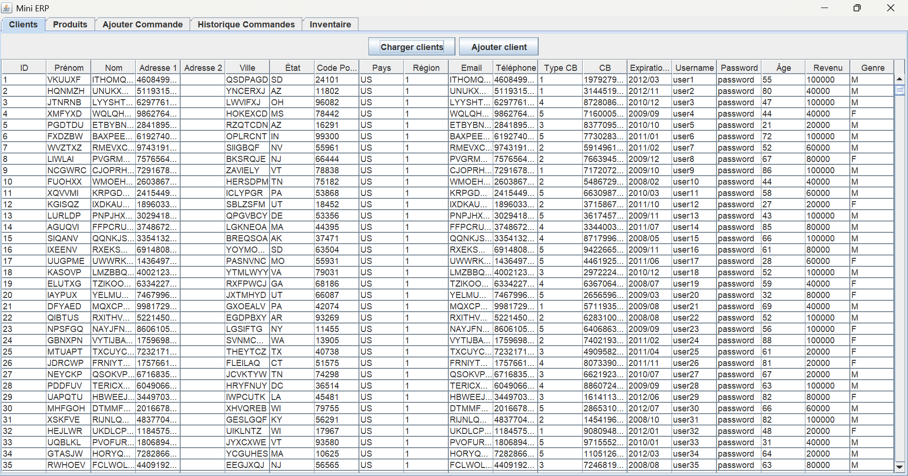
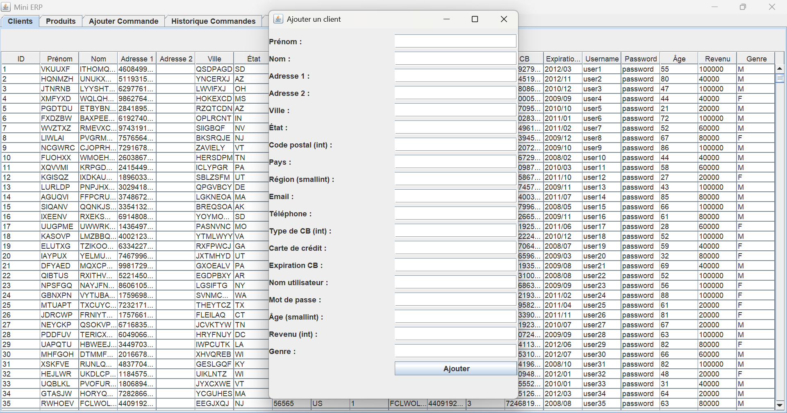
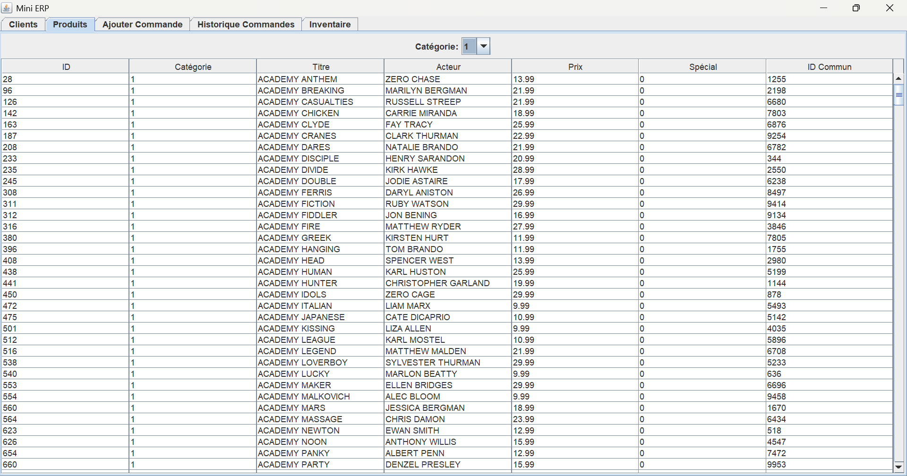
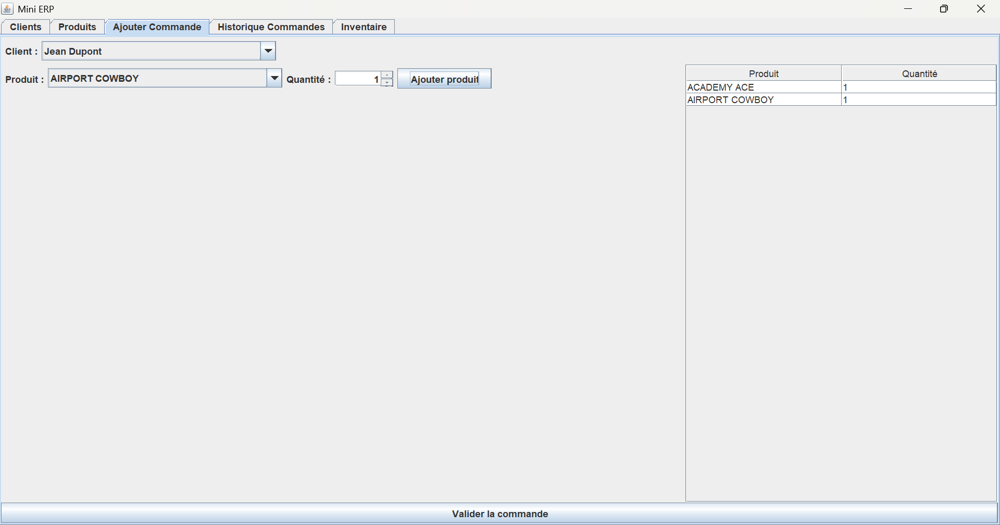
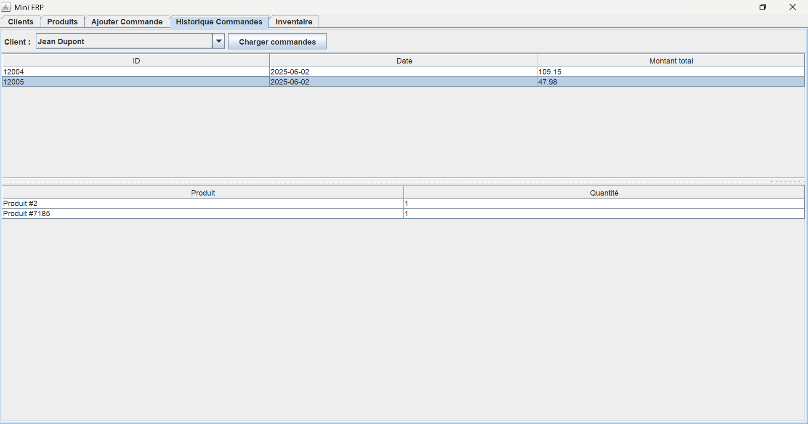

# 📦 MINI-ERP – Application de Gestion d'Entreprise en Java Swing

**MINI-ERP** est une application Java desktop développée avec Swing et AWT, permettant de gérer les opérations de base d’une petite entreprise.  
Elle se connecte à une base de données PostgreSQL via JDBC pour permettre la gestion des clients, des produits, des commandes et du stock.

---

## 🎯 Objectif pédagogique

Ce projet a été réalisé dans le cadre d’un TP individuel lors de ma formation chez Simplon, dans le but de :

- Développer une application Java complète avec interface graphique.
- Intégrer une base de données PostgreSQL à l’aide de JDBC.
- Appliquer les principes de conception (MVC, DAO, POJO).
- Gérer des transactions, des événements utilisateur et des requêtes SQL avancées.

---

## 🧩 Fonctionnalités principales

### 🧑‍💼 Gestion des clients
- Affichage dynamique des clients dans une JTable.
- Ajout de client via un formulaire Swing, utilisant une fonction SQL stockée (`new_customer(...)`).
- Validation des champs obligatoires avec retours utilisateur.

### 🛍️ Visualisation des produits
- Liste des produits avec prix et catégorie.
- Filtrage par catégorie via un `JComboBox`.

### 🧾 Gestion des commandes
- Création de commandes (sélection client + produits).
- Insertion des données dans les tables `orders` et `orderlines` via transaction JDBC.
- Calcul des montants : net, taxe, total.

### 📜 Historique des commandes
- Affichage des commandes passées pour un client sélectionné.
- Détail des lignes de commande avec jointure entre plusieurs tables.

### 📦 Suivi du stock
- Mise à jour du stock à chaque commande.
- Affichage des produits à reconstituer (quantité en stock < seuil).

---

## 🛠️ Technologies utilisées

| Composant            | Détail                                     |
|----------------------|--------------------------------------------|
| Langage              | Java 17 / 21 (selon JDK local)             |
| Interface graphique  | Swing + AWT                                |
| Base de données      | PostgreSQL (`store`)                       |
| Connexion BD         | JDBC                                       |
| Architecture         | MVC + DAO + POJO                           |
| IDE recommandé       | IntelliJ IDEA / VS Code                    |
| Données              | Stockées dans la base PostgreSQL           |

---

## 🗃️ Structure du code

- `DatabaseManager` : gestion centralisée de la connexion JDBC.
- `CustomerDAO`, `ProductDAO`, `OrderDAO`... : accès aux données via DAO.
- `*.java` (POJO) : objets de transfert de données.
- `*.Form.java` / `*.Panel.java` : interfaces Swing des modules.
- `MainFrame.java` : point d’entrée avec menu de navigation.

---

## 📌 Auteur

👨‍💻 **Quentin** – Étudiant développeur Fullstack Java  
🎓 Projet réalisé en solo dans le cadre de la formation Simplon  
📆 Mai 2025

---

Ce MINI-ERP constitue une base évolutive pour des fonctionnalités plus avancées :  
authentification des utilisateurs, reporting PDF, interface web ou déploiement cloud.

---

## 📸 Aperçu de l'interface

  
*Vue de la liste des clients*

  
*Vue du formulaire d'ajout d'un client*

  
*Vue de la liste des produits*

  
*Vue de la page d'ajout de commande*

  
*Vue de la page de visualisation des commandes*

  
*Vue de la page de visualisation des stocks*

---
